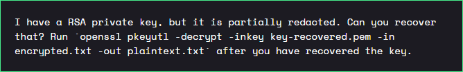
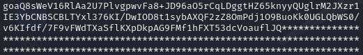
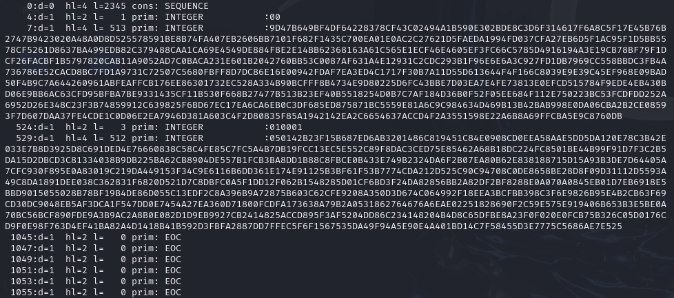

# Google CTF: Beginner's Quest - Redacted RSA 1
- Author: Ilja Ylikangas
- Challenge: [Google CTF: Beginner's Quest](https://capturetheflag.withgoogle.com/beginners-quest)

## Details:

- **Category**: Cryptography
- **Description**:  
  
- **Attachment**: 1 zip file containing `key.pem`, `encrypted.txt`

## Writeup:

### Overview

> **Notice**: This writeup is created with the intention of assisting those who may find themselves stuck during any steps on this challenge. It is highly encouraged to attemp resolving issues independently first. The flag will NOT be included in the solution.

**Prerequisites**:
- Basic cryptography concepts
- Ability to navigate directories and to install all necessary utilities
- Setting up a Python Virtual Environment OR use of `--break-system-packages`

---

## 1. Understanding the problem
Upon inspecting the key.pem file we notice that the RSA private key has indeed been partially redacted and replaced with multiple `*`s.
```bash
cat key.pem
```


To solve this challenge we need to decrypt `encrypted.txt` and to achieve this we need the complete RSA private key.

---

## 2. Fixing our file
PEM files are [Base64](https://en.wikipedia.org/wiki/Base64) encoded and follow the [ASN.1](https://en.wikipedia.org/wiki/ASN.1) structure for RSA private keys.

Since `*` is not a character that can be decoded with Base64 we need to replace it with something else.

Let's replace all `*`s in our original `key.pem` file with `A`s or any other valid placeholder and save this new file as `partial_key.pem`.
```bash
sed 's/\*/A/g' key.pem > partial_key.pem
```

Now we have a partial key that is valid in Base64.

---

## 3. RSA and ASN.1
Before extracting any data from our partial key we should take a very quick recap on what we are working with. 

[RSA](https://en.wikipedia.org/wiki/RSA_(cryptosystem)) is an asymmetric cryptographic algorithm which is based on factoring large prime numbers. When RSA keys are stored in files such as PEM format, they follow a specific [ASN.1](https://en.wikipedia.org/wiki/ASN.1) structure (in order of encoding):
- Modulus(`n`): A large integer derived from multiplying `p` and `q`
- Public Exponent (`e`): Typically a small prime number used in encryption
- Private Exponent (`d`): Used in decryption
- Prime (`p`): First prime used in modulus `n`.
- Prime(`q`): Second prime used in modulus `n`.
- Exponent (`d mod (p-1)`): Used in decryption
- Exponent (`d mod (q-1)`): Used in reducing the private exponent
- Coefficient (`q^-1 mod p`): Inverse of `q` modulo `p`.

In order for us to reconstruct the full RSA private key we need to know the values for `n`, `e`, and `d`. If we take a look at the internal structure of our now valid partial key we can try and search for them.

Let's examine our partial key with `asn1parse` which let's us take a look at the ASN.1 structure of our key.

```bash
openssl asn1parse -in partial_key.pem
```



Key observations:
- `d` shows us the ASN.1 depth
- `hl` is the header length in bytes
- `l` is the data length in bytes
- `INTEGER` is an integer value in hexadecimal.

---

## 4. Identifying the components
To identify any of our components we also need to know how they look.

- `n` is usually found at the top as the first large `INTEGER` after `0:d=0   hl=4`.

- `e` is a small `INTEGER`, often `010001` or `65537` in decimal.

- `d` is the first large `INTEGER` that follows `e`.

- `p` and `q` are large `INTEGER` values usually found further in the middle of the structure.

Using this information we can idenfity `n`, `e`, and `d` and begin to reconstruct the RSA private key.

## 5. Reconstructing the key
Tools like [rsatool](https://github.com/ius/rsatool) are specifically designed to help us with this sort of a challenge.

First we need to convert our hexadecimal `n` and `d` to decimal so that we may use them with rsatool.

The large values might cause a problem for the terminal's buffer so let's run a simple python script for both of them.

```bash
python3 -c "print(int('<value of n or d>', 16))"
```

We can now use rsatool to reconstruct the RSA private key. Let's also make sure to name our file as `key-recovered.pem` to match the challenge description.

```bash
python rsatool.py -f PEM -o key-recovered.pem -n <decimal n> -d <decimal d>
```

## 6. Decrypting the file
Let's use our reconstructed RSA private key to decrypt `encrypted.txt`. The challenge description already has the command for us to use.

```bash
openssl pkeyutl -decrypt -inkey key_recovered.pem -in encrypted.txt -out plaintext.txt
```

The flag is now readable in `plaintext.txt`.

---

## Takeaways
- Understanding file formats and RSA key structures
- Use of specialized tools to solve cryptographic problems

### References
- [Google CTF: Beginner's Quest](https://capturetheflag.withgoogle.com/beginners-quest)
- [rsatool Documentation](https://github.com/ius/rsatool)
- [Base64 encoding](https://en.wikipedia.org/wiki/Base64)
- [ASN.1 structure](https://en.wikipedia.org/wiki/ASN.1)

---
